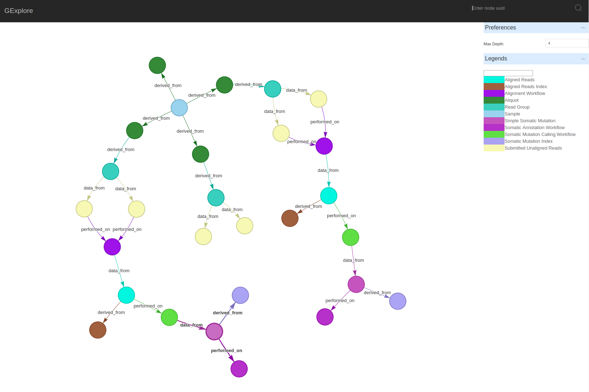

## Introduction

Graph Explorer (GExplorer) is a web application for visualizing graphical data stored using the GDC provided open source framework ([psqlgraph](https://github.com/NCI-GDC/psqlgraph)). The major goals of the project is to improve the speed at which one can understand the undelying structure of the graph and quickly detect problems in submitted data.

The project is currently in development phase

## Dependencies
* Python 2.7+
* [psqlgraph](https://github.com/NCI-GDC/psqlgraph)

### License
GExplorer is licensed under Apache v2 License